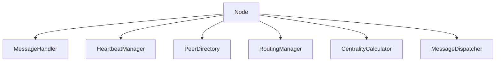
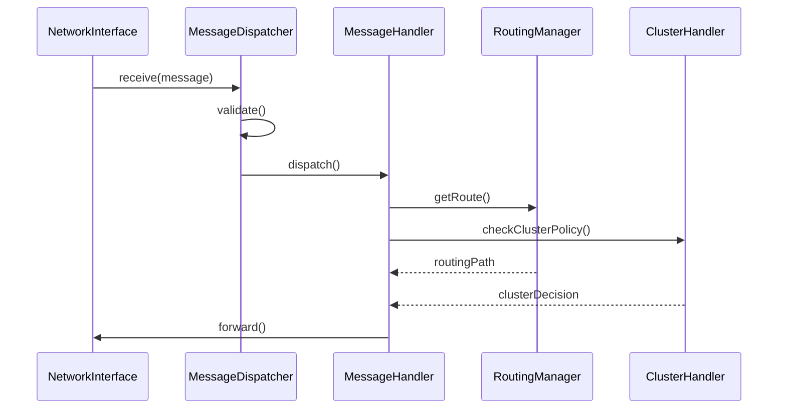
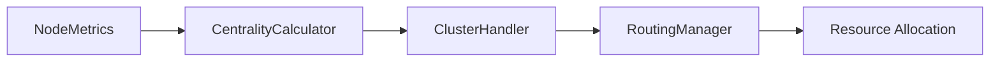

# V-Routing Protocol Architecture

## Overview
The V-Routing Protocol is designed as a modular, extensible system for peer-to-peer network routing with dynamic cluster formation and efficient message routing. This document outlines the high-level architecture and interactions between components.

## Core Components

### Node Management
The protocol's foundation is built on the `Node` class, which manages:
- Network state and phase transitions
- Message processing and routing
- Peer discovery and maintenance
- Cluster formation and management
- Resource monitoring and optimization

### Node Lifecycle
Nodes progress through multiple phases:
1. Discovery Phase
   - High-frequency heartbeats
   - Neighbor discovery
   - Initial topology mapping
2. Stabilization Phase
   - Centrality calculation
   - Cluster head election
   - Initial route establishment
3. Regular Phase
   - Normal message routing
   - Route optimization
   - Cluster maintenance
4. Stable Phase
   - Optimized routing
   - Efficient cluster structure
   - Resource optimization

### Message Processing Pipeline
Messages flow through the system following this pattern:
1. Reception via NetworkInterface
2. Validation and deduplication by MessageDispatcher
3. Processing by MessageHandler
4. Routing decisions by RoutingManager
5. Cluster-aware forwarding
6. Delivery confirmation

### Clustering Mechanism
The clustering system operates through:
1. Centrality Calculation
   - Eigenvector centrality using JGraphT
   - Fallback power iteration method
   - Multi-metric eligibility checks
2. Cluster Head Election
   - Network configuration checks
   - Resource availability verification
   - Centrality threshold validation
3. Cluster Formation
   - Member recruitment
   - Route optimization
   - Resource balancing

### Security Layer
Security is implemented through multiple layers:
- Message encryption
- Secure tunnels between clusters
- Cluster-based key management
- Node authentication
- Resource access control

### Resource Management
The system actively manages:
- Battery consumption
- Processing capacity
- Network bandwidth
- Memory utilization
- Storage allocation

## Component Interactions

### Network Discovery

### Message Routing

### Resource Optimization

## Implementation Details

### Core Classes
- `Node`: Abstract base class for network nodes
- `HeartbeatManager`: Manages network discovery and maintenance
- `RoutingManager`: Handles route calculation and optimization
- `CentralityCalculator`: Computes node importance metrics
- `PeerDirectory`: Maintains network topology information
- `MessageDispatcher`: Routes messages through the network
- `NodeMetrics`: Tracks node performance metrics

### Key Interfaces
- `MessageHandler`: Processes different message types
- `NetworkInterface`: Handles network I/O operations
- `ClusterHandler`: Manages cluster operations
- `SecurityProvider`: Implements security features

### Configuration
The system is highly configurable through `NetworkConfig`:
- Heartbeat intervals and decay
- Cluster formation thresholds
- Route optimization parameters
- Security settings
- Resource limits
