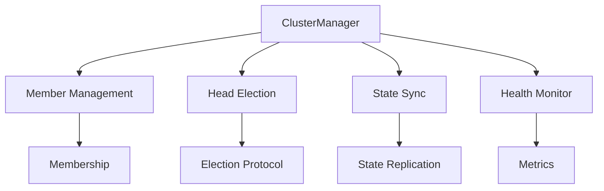
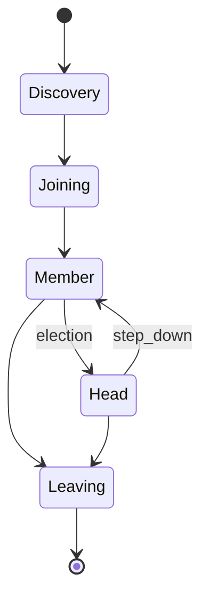
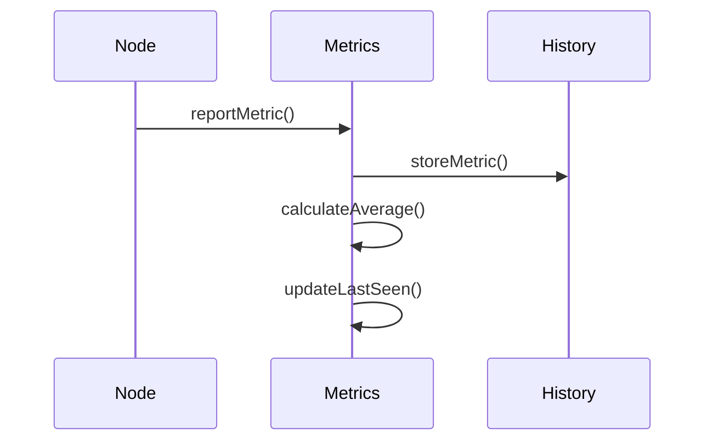
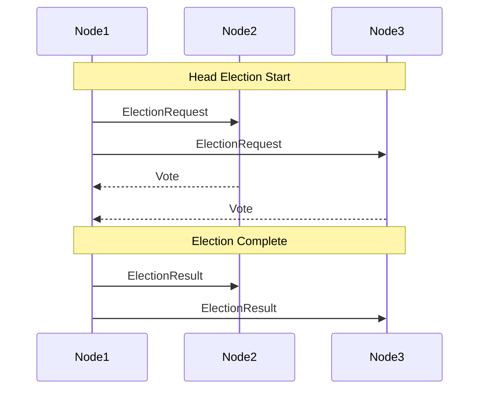

# Clustering Components Documentation

## Overview
The clustering components manage node organization, cluster formation, and maintenance in the V-Routing Protocol.

## ClusterManager
`com.vrouting.network.socket.cluster.ClusterManager`

### Purpose
Manages cluster formation, maintenance, and member coordination.

### Key Features
- Cluster member management
- Cluster head election
- State synchronization
- Health monitoring

### Architecture


### Usage Example
```java
ClusterManager cluster = new ClusterManager(nodeId, node);

// Handle cluster messages
cluster.handleClusterMessage(message);

// Check cluster status
if (cluster.isClusterHead()) {
    // Perform cluster head duties
}

// Get cluster members
Set<String> members = cluster.getClusterMembers();
```

### Cluster States


## ClusterMetrics
`com.vrouting.network.socket.cluster.ClusterMetrics`

### Purpose
Tracks and manages cluster performance metrics.

### Key Features
- Member count tracking
- Response time monitoring
- Message counting
- Health assessment

### Implementation Details
```java
public class ClusterMetrics {
    private final AtomicInteger memberCount;
    private final AtomicLong avgResponseTime;
    private final AtomicInteger messageCount;
    private final AtomicLong lastUpdateTime;
    
    public void updateMetrics() {
        // Update cluster metrics
        memberCount.set(getCurrentMemberCount());
        updateResponseTime(measureResponseTime());
        messageCount.incrementAndGet();
    }
}
```

### Metrics Collection


## Cluster Operations

### Member Management
1. Join Process:
   ```java
   void handleJoinRequest(Message message) {
       String senderId = message.getSource();
       clusterMembers.put(senderId, System.currentTimeMillis());
       sendClusterAcknowledgment(senderId);
   }
   ```

2. Leave Process:
   ```java
   void handleLeaveRequest(Message message) {
       String senderId = message.getSource();
       clusterMembers.remove(senderId);
       
       if (senderId.equals(clusterHeadId)) {
           initiateClusterHeadElection();
       }
   }
   ```

### Head Election


### State Synchronization
1. State Distribution:
   ```java
   void distributeState() {
       ClusterState state = getCurrentState();
       for (String member : clusterMembers.keySet()) {
           sendStateUpdate(member, state);
       }
   }
   ```

2. State Reception:
   ```java
   void handleStateUpdate(Message message) {
       ClusterState newState = message.getPayload();
       mergeState(newState);
       updateMetrics();
   }
   ```

## Maintenance Operations

### Health Monitoring
```java
void performMaintenance() {
    // Clean up stale members
    cleanupStaleMembers();
    
    // Update metrics
    metrics.updateMemberCount(clusterMembers.size());
    
    // Check cluster health
    if (needsReorganization()) {
        reorganizeCluster();
    }
}
```

### Resource Management
1. Memory Management:
   - Member state caching
   - Metric history pruning
   - Message deduplication

2. CPU Utilization:
   - Task scheduling
   - Work distribution
   - Load balancing

## Integration Examples

### With RoutingManager
```java
void updateClusterRoutes() {
    // Update routing paths for cluster members
    for (String member : getClusterMembers()) {
        RoutingPath path = computePathToMember(member);
        routingManager.updateRoutingPath(member, path);
    }
}
```

### With SecurityManager
```java
void establishClusterSecurity() {
    // Set up secure channels with cluster members
    for (String member : getClusterMembers()) {
        securityManager.establishTunnel(member);
    }
}
```

## Error Handling

### Failure Detection
1. Member Failures:
   - Heartbeat monitoring
   - Response timeouts
   - Connection failures

2. Head Failures:
   - Backup head monitoring
   - Automatic failover
   - State recovery

### Recovery Procedures
1. Member Recovery:
   ```java
   void handleMemberFailure(String memberId) {
       // Remove failed member
       clusterMembers.remove(memberId);
       
       // Update cluster state
       updateClusterState();
       
       // Notify other members
       broadcastMemberFailure(memberId);
   }
   ```

2. Head Recovery:
   ```java
   void handleHeadFailure() {
       // Initiate new election
       initiateClusterHeadElection();
       
       // Restore cluster state
       synchronizeClusterState();
       
       // Update routing
       updateClusterRoutes();
   }
   ```

## Performance Optimization

### Caching Strategies
1. Member Information:
   - State caching
   - Route caching
   - Metric caching

2. Operation Results:
   - Election results
   - Health checks
   - State updates

### Load Distribution
1. Work Assignment:
   - Task distribution
   - Resource allocation
   - Load balancing

2. Message Handling:
   - Message prioritization
   - Queue management
   - Batch processing

## Future Improvements
1. Advanced Clustering:
   - Hierarchical clusters
   - Dynamic reorganization
   - Role-based clustering

2. Enhanced Metrics:
   - Performance prediction
   - Anomaly detection
   - Trend analysis

3. Optimization:
   - Resource utilization
   - Communication overhead
   - State synchronization
