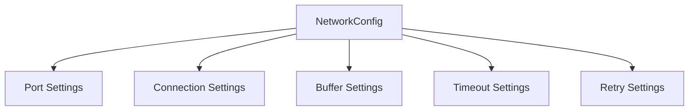

# Configuration Components Documentation

## Overview
The configuration components provide a flexible and type-safe way to configure various aspects of the V-Routing Protocol.

## NetworkConfig
`com.vrouting.network.socket.config.NetworkConfig`

### Purpose
Manages network-related configuration settings using the Builder pattern.

### Key Features
- Port configuration
- Connection limits
- Buffer sizes
- Timeouts
- Retry settings

### Architecture


### Usage Example
```java
NetworkConfig config = new NetworkConfig.Builder()
    .port(8080)
    .maxConnections(100)
    .bufferSize(8192)
    .connectionTimeout(30000)
    .heartbeatInterval(5000)
    .maxRetries(3)
    .build();
```

### Configuration Parameters

#### Network Settings
```java
public class NetworkConfig {
    private final int port;              // Network port
    private final int maxConnections;    // Maximum concurrent connections
    private final int bufferSize;        // Socket buffer size
    private final long connectionTimeout; // Connection timeout in ms
    private final long heartbeatInterval; // Heartbeat interval in ms
    private final int maxRetries;        // Maximum retry attempts
}
```

#### Default Values
```java
public static class Builder {
    private int port = 8080;
    private int maxConnections = 100;
    private int bufferSize = 8192;
    private long connectionTimeout = 30000;
    private long heartbeatInterval = 5000;
    private int maxRetries = 3;
}
```

## Configuration Management

### Loading Configuration
1. From File:
   ```java
   public static NetworkConfig fromFile(String path) {
       Properties props = new Properties();
       props.load(new FileInputStream(path));
       
       return new Builder()
           .port(Integer.parseInt(props.getProperty("port")))
           .maxConnections(Integer.parseInt(props.getProperty("maxConnections")))
           .build();
   }
   ```

2. From Environment:
   ```java
   public static NetworkConfig fromEnvironment() {
       return new Builder()
           .port(Integer.getInteger("VROUTING_PORT", 8080))
           .maxConnections(Integer.getInteger("VROUTING_MAX_CONN", 100))
           .build();
   }
   ```

### Validation Rules
```java
private void validate() {
    if (port <= 0 || port > 65535) {
        throw new IllegalArgumentException("Invalid port number");
    }
    if (maxConnections <= 0) {
        throw new IllegalArgumentException("Invalid max connections");
    }
    if (bufferSize <= 0) {
        throw new IllegalArgumentException("Invalid buffer size");
    }
    if (connectionTimeout <= 0) {
        throw new IllegalArgumentException("Invalid timeout");
    }
}
```

## Integration Examples

### With NetworkInterface
```java
NetworkInterface network = new NetworkInterface(config);
network.start();

// Access configuration
int port = network.getConfig().getPort();
long timeout = network.getConfig().getConnectionTimeout();
```

### With Node
```java
Node node = new Node(nodeId, config);
node.configure(builder -> 
    builder.port(8080)
           .maxConnections(200)
           .build()
);
```

## Configuration Categories

### Network Settings
1. Connection Parameters:
   - Port number
   - Maximum connections
   - Connection timeout
   - Keep-alive interval

2. Buffer Settings:
   - Buffer size
   - Queue capacity
   - Batch size

### Performance Settings
1. Thread Pool:
   - Core pool size
   - Maximum pool size
   - Keep-alive time

2. Resource Limits:
   - Memory limits
   - Cache size
   - Queue capacity

### Security Settings
1. Encryption:
   - Key size
   - Algorithm selection
   - Key rotation interval

2. Authentication:
   - Token validity
   - Session timeout
   - Max retry attempts

## Best Practices

### Configuration Management
1. Validation:
   - Type checking
   - Range validation
   - Dependency checking

2. Documentation:
   - Parameter descriptions
   - Default values
   - Valid ranges

### Error Handling
1. Validation Errors:
   ```java
   try {
       config = NetworkConfig.fromFile("config.properties");
   } catch (ConfigurationException e) {
       // Use default configuration
       config = NetworkConfig.getDefault();
       logger.warn("Using default configuration: {}", e.getMessage());
   }
   ```

2. Missing Values:
   ```java
   private String getConfigValue(String key, String defaultValue) {
       String value = System.getProperty(key);
       if (value == null) {
           value = System.getenv(key);
       }
       return value != null ? value : defaultValue;
   }
   ```

## Performance Considerations

### Memory Usage
1. Configuration Caching:
   - Cache immutable configurations
   - Share common settings
   - Minimize object creation

2. Resource Management:
   - Clean up unused configurations
   - Pool reusable objects
   - Minimize memory footprint

### Thread Safety
1. Immutable Configuration:
   ```java
   public final class NetworkConfig {
       private final int port;
       private final int maxConnections;
       
       private NetworkConfig(Builder builder) {
           this.port = builder.port;
           this.maxConnections = builder.maxConnections;
       }
   }
   ```

2. Thread-Safe Updates:
   ```java
   public void updateConfig(Consumer<Builder> updater) {
       Builder builder = new Builder()
           .port(this.port)
           .maxConnections(this.maxConnections);
       
       updater.accept(builder);
       this.config = builder.build();
   }
   ```

## Future Improvements
1. Dynamic Configuration:
   - Runtime updates
   - Hot reloading
   - Configuration versioning

2. Advanced Features:
   - Configuration inheritance
   - Profile support
   - Environment-specific settings

3. Monitoring:
   - Configuration auditing
   - Change tracking
   - Impact analysis
