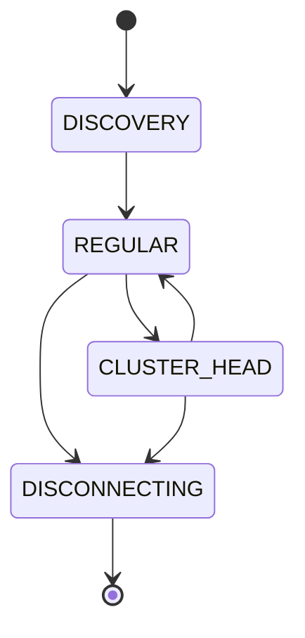
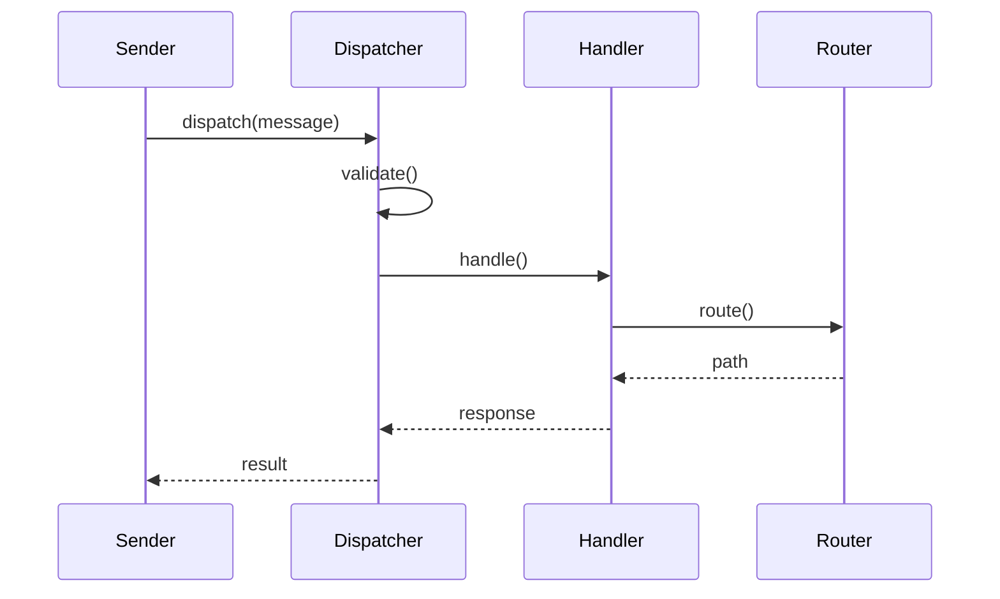

# Core Components Documentation

## Overview
The core components form the foundation of the V-Routing Protocol. They handle essential functions like message processing, network communication, and state management.

## Node
`com.vrouting.network.socket.core.Node`

### Purpose
The Node class represents a participant in the V-Routing network. It manages the node's lifecycle, state transitions, and message handling.

### Key Features
- State management (DISCOVERY, REGULAR, CLUSTER_HEAD, DISCONNECTING)
- Message processing
- Peer communication
- Resource management

### Usage Example
```java
NetworkConfig config = new NetworkConfig.Builder()
    .port(8080)
    .maxConnections(100)
    .build();

Node node = new Node("node1", config);
node.start();
```

### State Transitions


## HeartbeatManager
`com.vrouting.network.socket.core.HeartbeatManager`

### Purpose
Manages heartbeat messages to maintain network connectivity and monitor peer health.

### Key Features
- Configurable heartbeat intervals
- Exponential backoff
- Failure detection
- Health monitoring

### Implementation Details
```java
public class HeartbeatManager {
    private final ScheduledExecutorService scheduler;
    private final Map<String, Long> lastHeartbeats;
    private final long baseInterval;
    
    // Methods
    public void startHeartbeat()
    public void stopHeartbeat()
    public void handleHeartbeat(String peerId)
    public boolean isAlive(String peerId)
}
```

## PeerDirectory
`com.vrouting.network.socket.core.PeerDirectory`

### Purpose
Maintains information about known peers and their current status.

### Key Features
- Peer state tracking
- Metric collection
- Path management
- Health monitoring

### Data Structures
```java
class PeerInfo {
    String id;
    NodeState state;
    Map<String, Double> metrics;
    List<RoutingPath> paths;
    long lastSeen;
}
```

## MessageHandler
`com.vrouting.network.socket.core.MessageHandler`

### Purpose
Interface defining methods for processing different types of messages.

### Message Types
1. HEARTBEAT
2. ROUTING
3. CLUSTER
4. SECURITY
5. DATA

### Implementation Example
```java
public interface MessageHandler {
    Message handleMessage(Message message);
    void handleError(Message message, Exception error);
    boolean canHandle(MessageType type);
}
```

## NetworkInterface
`com.vrouting.network.socket.core.NetworkInterface`

### Purpose
Handles low-level network communication and socket operations.

### Key Features
- Connection management
- Message serialization
- Error handling
- Resource cleanup

### Configuration Options
```java
NetworkConfig config = new NetworkConfig.Builder()
    .port(8080)
    .maxConnections(100)
    .bufferSize(8192)
    .connectionTimeout(30000)
    .build();
```

## MessageDispatcher
`com.vrouting.network.socket.core.MessageDispatcher`

### Purpose
Routes messages to appropriate handlers and manages message forwarding.

### Message Flow


### Key Features
- Message validation
- Handler registration
- Route selection
- Error handling

## Integration
These components work together to provide:
1. Reliable message delivery
2. Network stability
3. Efficient routing
4. Resource optimization

## Error Handling
Each component implements specific error handling:
1. Node: State recovery
2. HeartbeatManager: Connection recovery
3. PeerDirectory: Stale entry cleanup
4. NetworkInterface: Connection retry

## Performance Optimization
Components are optimized for:
1. Memory usage
2. CPU utilization
3. Network bandwidth
4. Resource cleanup

## Thread Safety
All components are designed to be thread-safe:
- Immutable where possible
- Synchronized access
- Atomic operations
- Lock-free algorithms
