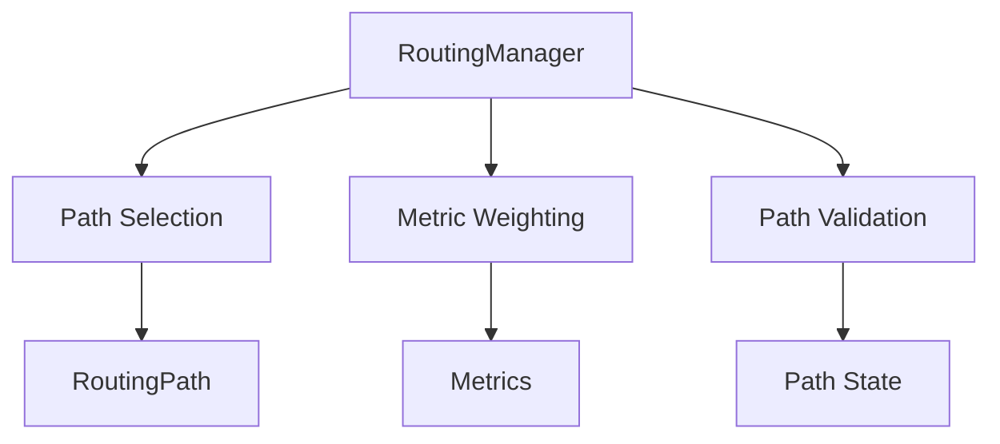
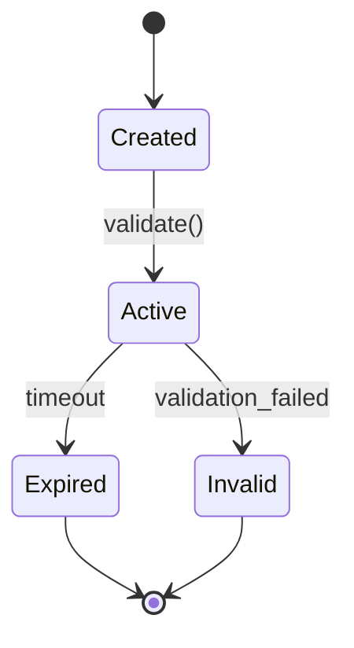
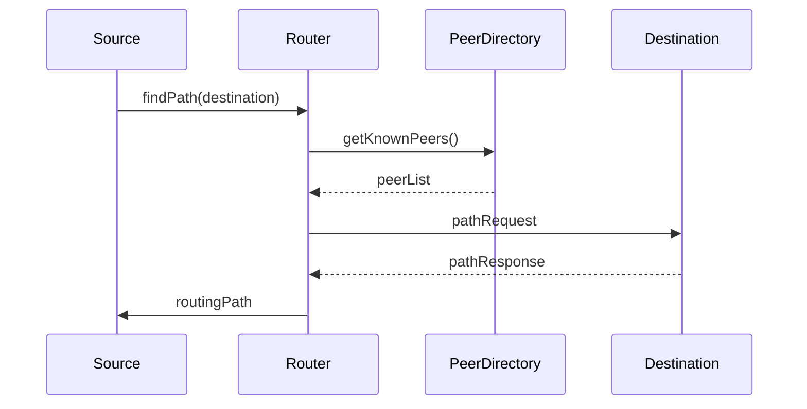

# Routing Components Documentation

## Overview
The routing components manage path discovery, selection, and optimization in the V-Routing Protocol.

## RoutingManager
`com.vrouting.network.socket.routing.RoutingManager`

### Purpose
Manages routing decisions and path selection for network communication.

### Key Features
- Path discovery and maintenance
- Metric-based path selection
- Route optimization
- Path validation

### Architecture


### Usage Example
```java
RoutingManager router = new RoutingManager(nodeId, peerDirectory);

// Update routing path
RoutingPath path = new RoutingPath(routeNodes, metrics);
router.updateRoutingPath(destination, path);

// Get best path
Optional<RoutingPath> bestPath = router.selectBestPath(destination);
```

### Metric Weights
```java
private void initializeMetricWeights() {
    metricWeights.put("latency", 0.4);
    metricWeights.put("bandwidth", 0.3);
    metricWeights.put("reliability", 0.3);
}
```

## RoutingPath
`com.vrouting.network.socket.routing.RoutingPath`

### Purpose
Represents and manages a single routing path in the network.

### Key Features
- Path metrics tracking
- Path validation
- Usage statistics
- Score calculation

### Implementation Details
```java
public class RoutingPath {
    private final List<String> path;
    private final Map<String, Double> metrics;
    private final long createdTime;
    private volatile long lastUpdated;
    private volatile int useCount;
    
    public double calculateScore(Map<String, Double> weights) {
        return metrics.entrySet().stream()
            .mapToDouble(e -> e.getValue() * weights.getOrDefault(e.getKey(), 0.0))
            .sum();
    }
}
```

### Path Lifecycle


## Routing Process

### Path Discovery


### Path Selection Algorithm
1. Metric Evaluation:
   ```java
   double score = path.getMetrics().entrySet().stream()
       .mapToDouble(e -> e.getValue() * weights.get(e.getKey()))
       .sum();
   ```

2. Path Validation:
   ```java
   boolean isValid = path.getHopCount() <= maxHops &&
                    System.currentTimeMillis() - path.getLastUpdated() < maxAge &&
                    path.getMetrics().get("reliability") > minReliability;
   ```

3. Selection Process:
   ```java
   Optional<RoutingPath> bestPath = paths.stream()
       .filter(RoutingPath::isValid)
       .max(Comparator.comparingDouble(p -> p.calculateScore(weights)));
   ```

## Metric Types

### Network Metrics
1. Latency:
   - Round-trip time
   - Processing delay
   - Queue delay

2. Bandwidth:
   - Available bandwidth
   - Used bandwidth
   - Capacity

3. Reliability:
   - Packet loss rate
   - Error rate
   - Link stability

### Path Metrics
1. Hop Count:
   - Number of intermediate nodes
   - Path length
   - Route complexity

2. Path Age:
   - Creation time
   - Last update time
   - Expiration time

3. Usage Statistics:
   - Use count
   - Success rate
   - Failure rate

## Optimization Strategies

### Path Optimization
1. Metric Weighting:
   - Dynamic weight adjustment
   - Context-based weights
   - Performance history

2. Path Selection:
   - Multiple path support
   - Alternate route maintenance
   - Load balancing

### Performance Optimization
1. Caching:
   - Path cache
   - Metric cache
   - Decision cache

2. Resource Management:
   - Memory efficiency
   - CPU utilization
   - Network overhead

## Integration Examples

### With MessageDispatcher
```java
void dispatchMessage(Message message) {
    RoutingPath path = routingManager.selectBestPath(message.getDestination())
        .orElseThrow(() -> new NoRouteException());
    
    message.setRoutingPath(path);
    path.incrementUseCount();
    networkInterface.send(message);
}
```

### With ClusterManager
```java
void handleClusterUpdate(ClusterMessage update) {
    // Update routing information based on cluster changes
    update.getClusterPaths().forEach((dest, path) -> 
        routingManager.updateRoutingPath(dest, path)
    );
}
```

## Error Handling

### Path Failures
1. Detection:
   - Timeout monitoring
   - Error rate tracking
   - Health checks

2. Recovery:
   - Alternate path selection
   - Path recomputation
   - Metric updates

### Resource Exhaustion
1. Prevention:
   - Resource limits
   - Cache management
   - Path pruning

2. Recovery:
   - Resource cleanup
   - Cache invalidation
   - Path regeneration

## Future Improvements
1. Machine Learning Integration:
   - Path prediction
   - Anomaly detection
   - Performance optimization

2. Advanced Metrics:
   - QoS parameters
   - Security metrics
   - Cost factors

3. Dynamic Optimization:
   - Real-time adaptation
   - Context awareness
   - Performance tuning
