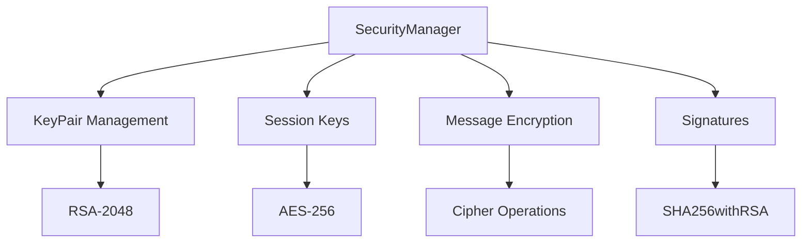
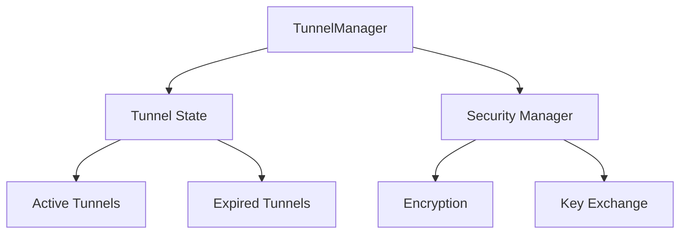
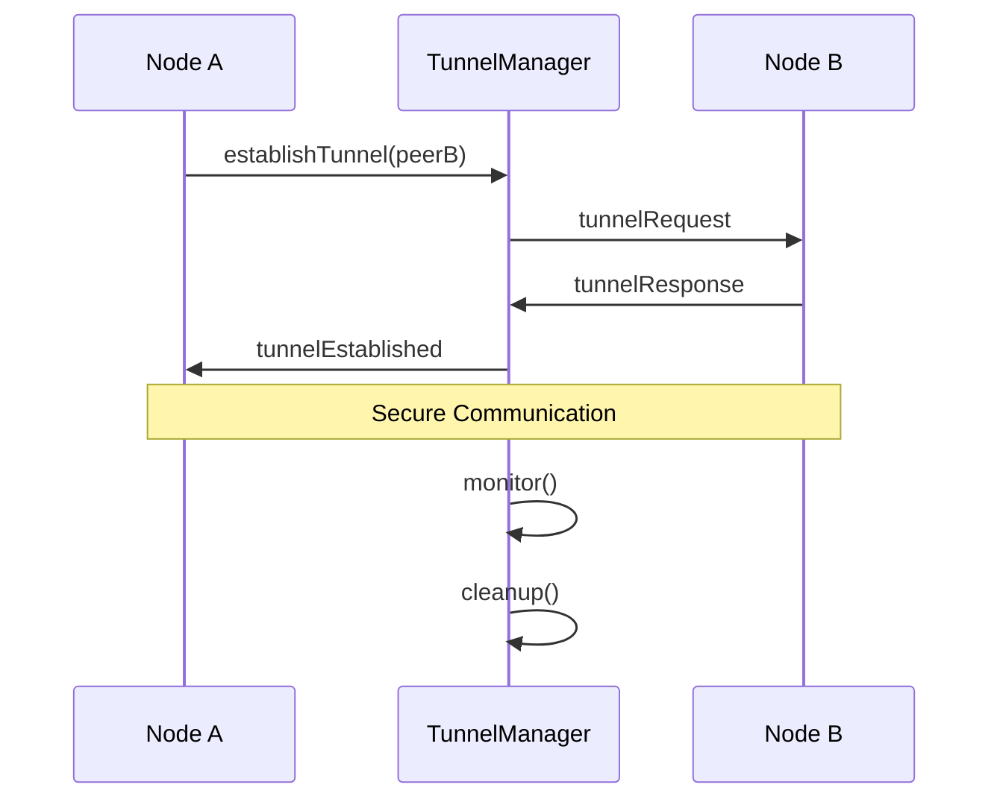

# Security Components Documentation

## Overview
The security components provide encryption, authentication, and secure communication channels for the V-Routing Protocol.

## SecurityManager
`com.vrouting.network.socket.security.SecurityManager`

### Purpose
Manages cryptographic operations, key management, and message security.

### Key Features
- RSA key pair generation
- AES session key management
- Message encryption/decryption
- Digital signatures

### Architecture


### Usage Example
```java
SecurityManager security = new SecurityManager();

// Encrypt message
byte[] encrypted = security.encryptMessage(peerId, messageData);

// Sign data
byte[] signature = security.signData(messageData);

// Verify signature
boolean isValid = security.verifySignature(peerId, messageData, signature);
```

### Security Considerations
1. Key Generation:
   - Uses RSA-2048 for asymmetric encryption
   - Secure random number generation
   - Key validation

2. Session Management:
   - Unique session keys per peer
   - Automatic key rotation
   - Session expiration

3. Error Handling:
   - Secure error messages
   - Failed operation recovery
   - Resource cleanup

## TunnelManager
`com.vrouting.network.socket.security.TunnelManager`

### Purpose
Manages secure communication tunnels between nodes.

### Key Features
- Tunnel establishment
- Session management
- Tunnel state monitoring
- Automatic cleanup

### Architecture


### Implementation Details
```java
public class TunnelManager {
    private final SecurityManager securityManager;
    private final Map<String, TunnelState> tunnels;
    
    class TunnelState {
        SecretKey key;
        long establishedTime;
        long lastUsed;
        
        boolean isExpired() {
            return System.currentTimeMillis() - lastUsed > 3600000;
        }
    }
}
```

### Tunnel Lifecycle


### Security Protocol
1. Tunnel Establishment:
   ```
   1. Node A -> Node B: TUNNEL_REQUEST
      - Public key
      - Supported algorithms
      - Nonce
   
   2. Node B -> Node A: TUNNEL_RESPONSE
      - Encrypted session key
      - Selected algorithm
      - Signed nonce
   
   3. Node A -> Node B: TUNNEL_CONFIRM
      - Encrypted test message
      - Message authentication code
   ```

2. Message Exchange:
   ```
   1. Encrypt message with session key
   2. Add message authentication code
   3. Send through tunnel
   4. Verify and decrypt at destination
   ```

### Error Recovery
1. Tunnel Failures:
   - Automatic retry with backoff
   - Alternative tunnel establishment
   - Resource cleanup

2. Key Compromise:
   - Immediate tunnel shutdown
   - Key revocation
   - New tunnel establishment

## Integration with Other Components

### With NetworkInterface
```java
// Send encrypted message through tunnel
byte[] data = prepareMessage();
byte[] encrypted = tunnelManager.sendThroughTunnel(peerId, data);
networkInterface.send(peerId, encrypted);
```

### With MessageDispatcher
```java
// Process received encrypted message
void handleMessage(Message message) {
    if (tunnelManager.hasTunnel(message.getSource())) {
        byte[] decrypted = tunnelManager.receiveFromTunnel(
            message.getSource(), 
            message.getPayload()
        );
        processDecryptedMessage(decrypted);
    }
}
```

## Performance Considerations

### Caching
- Session key caching
- Tunnel state caching
- Cryptographic operation results

### Resource Management
- Tunnel cleanup
- Key rotation
- Memory usage optimization

### Monitoring
- Tunnel health
- Cryptographic operation timing
- Resource utilization

## Thread Safety
All security components are thread-safe:
- Immutable cryptographic parameters
- Synchronized tunnel operations
- Atomic state updates
- Thread-safe collections

## Future Improvements
1. Perfect Forward Secrecy
2. Post-quantum cryptography support
3. Hardware security module integration
4. Enhanced key management
